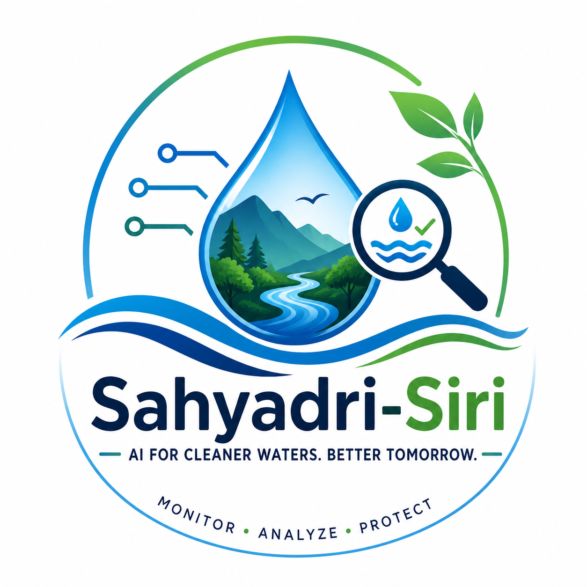

<div align="center">
  
  <h1>Sahyadri-Siri 🌊</h1>
  <p><b>AI-Powered Water Quality Monitoring Ecosystem</b></p>

  [-blue.svg?style=for-the-badge&logo=android)](https://android.com)
  [](https://developer.android.com/jetpack/compose)
  [](https://fastapi.tiangolo.com)
  [](https://deepmind.google/technologies/gemini/)
</div>

<br/>

## 🌟 Overview

**Sahyadri-Siri** is a next-generation water quality monitoring application built to protect and analyze the water bodies of the Sahyadri (Western Ghats) region. Leveraging cutting-edge AI and a beautiful glassmorphism Android interface, it empowers citizens to report water conditions and provides authorities with real-time, AI-driven actionable insights.

---

## ✨ Features

### 💎 Premium Glassmorphism UI
- **Backward-Compatible Aesthetics**: Stunning frosted glass interfaces, deep-ocean gradients, and micro-animations built with **Jetpack Compose**.
- **Broad Compatibility**: Designed to run flawlessly on legacy devices (Android 7.0+) up to modern flagships (Android 14+), utilizing advanced backward-compatible gradient meshes.
- **Dynamic Theming**: Seamless switching between Dark Mode, Light Mode, and System Default.

### 🧠 Gemini AI Advisories
- **Dynamic Flashcards**: View AI-generated water advisories in a 3D-tilt, swipeable carousel.
- **Context-Aware Analytics**: The AI analyzes turbidity, pH (mocked), and clarity to generate localized warnings and safe usage guidelines.

### 🌍 Deep Localization
- **Instant Translation**: Fully localized in English and Kannada.
- **Dynamic Data Binding**: The GenAI output translates seamlessly without requiring an app restart.

### 🗺️ Real-Time Alerts Map
- **Dark-Mode OpenStreetMap**: Beautiful custom ColorMatrix filtering dynamically inverts map tiles to match the premium dark theme.
- **Live Feed**: Staggered, animated alert feeds showing the most critical pollution reports instantly.

---

## 🏗️ Architecture

### 📱 Frontend (Android)
- **Framework**: Kotlin & Jetpack Compose
- **Architecture**: MVVM with StateFlow
- **Dependency Injection**: Hilt
- **UI System**: Custom "Glassmorphism" design system

### ⚙️ Backend & AI (FastAPI + Gemini)
The backend leverages Python's **FastAPI** to handle high-throughput telemetry data from the Android client. 
- **Endpoint Design**: RESTful APIs for submitting reports and fetching aggregated metrics.
- **GenAI Integration**: Google's Gemini models process unstructured environmental text and numerical scores to generate human-readable advisories in real time.
- **Database**: Extensible structure ready for PostgreSQL/PostGIS for spatial water data queries.

---

## 🚀 Getting Started

### Prerequisites
- Android Studio Iguana+
- JDK 17
- Python 3.10+ (for backend)

### Building the Android App
1. Clone the repository:
   ```bash
   git clone https://github.com/Kubendra2004/Sahyadiri-Siri.git
   ```
2. Open the project in Android Studio.
3. Sync Gradle (Ensure Java 17 is selected).
4. Run `installDebug` or press the Play button to install on your emulator/device.

---

## 📸 Screenshots (Coming Soon)

*(Add your beautiful screenshots here of the Login, Home, Map, and Alerts screens!)*

---

<div align="center">
  <i>"AI for cleaner waters. Better tomorrow."</i>
</div>
